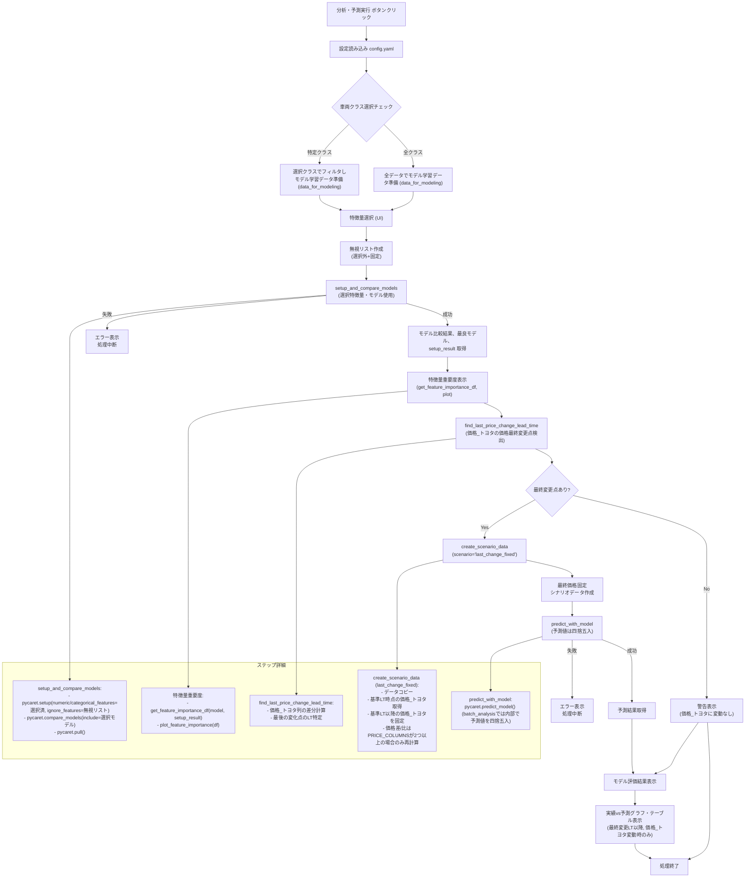

# 利用台数予測と分析の実行フロー

このドキュメントは、Streamlitアプリケーションで「分析・予測実行」ボタンがクリックされた後の、データ処理、モデル比較、予測、結果表示までの詳細なフローを説明します。

## 概要

ユーザーが分析対象のデータ（CSVファイル、車両クラス、利用日）を選択し、特徴量や評価したいモデル (`config.yaml` またはUIで設定可能) を指定して「分析・予測実行」ボタンを押すと、以下の主要な処理が実行されます。

1.  **モデル学習用データの準備:** 選択された車両クラスに基づいて、モデル学習に使用するデータを準備します。
2.  **特徴量の準備と無視リストの作成:** UIで選択された数値・カテゴリ特徴量を特定し、選択されなかった特徴量や特定の不要な列 (`曜日_name` など) を無視リスト (`ignore_features`) に追加します。
3.  **モデル比較と最良モデルの選択:** PyCaretライブラリを使用し、ユーザーが選択した特徴量と機械学習モデルを用いて訓練・評価し、指定された評価指標（RMSE）に基づいて最も性能の良いモデル（最良モデル）とPyCaretのセットアップ結果 (`setup_result`) を選択します。
4.  **特徴量重要度の表示:** 最良モデルと `setup_result` を用いて特徴量重要度を計算し、グラフとテーブルで表示します。
5.  **価格最終変更点の検出:** 選択された利用日の実績データから、価格 (`価格_トヨタ`) が最後に変更されたリードタイムを自動的に検出します。
6.  **予測用シナリオデータの作成:** 上記で検出された最終変更リードタイム `X` とその時点での価格に基づき、「もしリードタイム `X` 以降の価格が、リードタイム `X` 時点の価格で一定だったら」という仮定のシナリオデータを作成します。（価格変更がない場合は、このシナリオでの予測は行いません。）
7.  **予測の実行:** 選択された最良モデルとシナリオデータを用いて、利用台数の予測値を計算します。
8.  **結果の表示:** モデル比較の結果（各モデルの評価指標）と、価格変動があった場合には実績データと予測結果（最終価格固定シナリオ）を比較するグラフとテーブルを表示します。表示は価格最終変更リードタイム以降の期間に限定されます。価格変動がなかった場合は、その旨の警告が表示され、比較グラフ・テーブルは表示されません。

## 処理フロー図 (Mermaid)

## 各ステップの詳細

1.  **モデル学習用データの準備 (`app.py`)**
    *   ユーザーがサイドバーで選択した「車両クラス」に基づき、`data` DataFrameからモデル学習に使用するデータ (`data_for_modeling`) をフィルタリングします。「全クラス」が選択された場合は、元の `data` がそのまま使用されます。

2.  **特徴量の準備と無視リストの作成 (`app.py`)**
    *   `data_for_modeling` から数値・カテゴリ特徴量の候補を抽出します。
    *   StreamlitのUI (`st.multiselect`) でユーザーが選択した数値特徴量 (`selected_numeric`) とカテゴリ特徴量 (`selected_categorical`) を取得します。デフォルト選択は `config.yaml` またはアプリケーションのデフォルトに基づきます。
    *   **無視リスト (`final_ignore_features`) の作成:**
        *   UIで選択 *されなかった* 数値特徴量とカテゴリ特徴量をリストアップします。
        *   `app.py` 内で明示的に指定されている不要な列 (例: `['曜日_name', 'en_name']`) を追加します。
        *   これらを結合して最終的な無視リストとします。

3.  **モデル比較と最良モデル選択 (`setup_and_compare_models` in `utils/modeling.py`)**
    *   **入力:** モデル学習用データ (`data_for_modeling`)、目的変数名 (`TARGET_VARIABLE`)、UIで選択された数値・カテゴリ特徴量のリスト (`valid_numeric`, `valid_categorical`)、**作成された無視リスト (`final_ignore_features`)**、UIで選択された比較対象モデルのリスト (`models_to_compare`)。
    *   **処理:**
        *   `pycaret.regression.setup()`: PyCaret環境を初期化。**`numeric_features` と `categorical_features` には選択された特徴量リストを、`ignore_features` には作成した無視リストを渡します。** データ型推論、欠損値補完、カテゴリ特徴量エンコーディング等の前処理パイプラインを定義し、データを訓練/テスト用に分割します。
        *   `pycaret.regression.compare_models()`: `setup`で定義されたパイプラインを適用後、指定モデル (`include_models`) を訓練・評価し、RMSEに基づいてランク付け、最良モデルを返します。
        *   `pycaret.regression.pull()`: `compare_models` の実行結果 (評価指標テーブル) をDataFrameで取得します。
    *   **出力:** 最良モデルオブジェクト (`best_model`)、モデル比較結果DataFrame (`comparison_results`)、**PyCaretセットアップ結果オブジェクト (`setup_result`)**。失敗時は `None`, 空DataFrame, `setup_result` (またはNone) を返します。

4.  **特徴量重要度の表示 (`app.py` 内で `utils/modeling.py`, `utils/visualization.py` の関数を呼び出し)**
    *   **入力:** 最良モデル (`best_model`)、PyCaretセットアップ結果 (`setup_result`)。
    *   **処理:**
        *   `get_feature_importance_df(best_model, setup_result)`: 最良モデルから特徴量重要度を抽出し、前処理後の特徴量名と対応付けたDataFrameを作成します。
        *   `plot_feature_importance(importance_df)`: 上記DataFrameからPlotlyの横棒グラフを生成します。
        *   `st.plotly_chart()` と `st.dataframe()`: 生成されたグラフとDataFrameをStreamlit上に表示します。モデルによっては重要度が取得できない場合もあります。
    *   **出力:** Streamlit画面へのグラフとテーブルの表示。

5.  **価格最終変更点検出 (`find_last_price_change_lead_time` in `utils/data_processing.py`)**
    *   **入力:** 選択された特定日のデータ (`data_filtered_sorted`)、価格列名リスト (`PRICE_COLUMNS` = `['価格_トヨタ']`)、リードタイム列名 (`LEAD_TIME_COLUMN`)。
    *   **処理:**
        *   `価格_トヨタ` 列で、リードタイム降順で価格が前回から変化した最後の箇所を探します。
        *   変化がなければ `None` を返します。
    *   **出力:** 最後に価格が変更されたリードタイム (整数)、または `None`。

6.  **予測用シナリオデータ作成 (`create_scenario_data` in `utils/data_processing.py`)**
    *   **入力:** 特定日のデータ (`data_filtered_sorted`)、価格列名リスト (`PRICE_COLUMNS` = `['価格_トヨタ']`)、リードタイム列名 (`LEAD_TIME_COLUMN`)、`scenario_type='last_change_fixed'`、検出された最終変更リードタイム (`change_lead_time`)。
    *   **処理 (`last_change_fixed` シナリオ):**
        *   入力データをコピー。
        *   `change_lead_time` 時点の実績の `価格_トヨタ` を取得。
        *   コピーデータで、リードタイムが `change_lead_time` **以下**の行の `価格_トヨタ` を上記固定価格で上書き。
        *   価格差 (`価格差`) と価格比 (`価格比`) は、`PRICE_COLUMNS` 定数に2つ以上の列が指定されている場合にのみ再計算されます（現在は `['価格_トヨタ']` のみなため、実質再計算されず、NaNのままか元々の値が維持されます）。
    *   **出力:** `価格_トヨタ` 情報がシナリオに基づいて変更されたDataFrame (`data_scenario`)。`価格_トヨタ` に変動がない場合や失敗時は空のDataFrameを返すことがあります。

7.  **予測実行 (`predict_with_model` in `utils/modeling.py` / バッチ分析の場合は `batch_predict_date` in `utils/batch_analysis.py`)**
    *   **入力:** 最良モデル (`best_model`)、シナリオデータ (`data_scenario`)。
    *   **処理:** `pycaret.regression.predict_model()` またはモデルの `predict()` メソッドで予測値を計算。バッチ分析 (`batch_predict_date`) の場合は、この予測値が内部で四捨五入されます。
    *   **出力:** 元のシナリオデータに予測結果列 (`prediction_label`) が追加されたDataFrame (`predictions`)。失敗時は空のDataFrame。

8.  **結果の表示 (`app.py` または `page_batch_analysis.py`)**
    *   **モデル評価比較結果:** ステップ3で取得した `comparison_results` DataFrame を `st.dataframe()` で表示。
    *   **実績 vs 予測比較グラフ・テーブル:**
        *   **`価格_トヨタ` の変動が検出され (`last_change_lt is not None`)、かつ予測が成功した場合のみ表示されます。**
        *   ステップ7で取得した `predictions` DataFrame と、元の特定日のデータ (`data_filtered_sorted`) を使用します。
        *   **表示するデータは、リードタイムが `last_change_lt` 以下の期間にフィルタリングされます。**
        *   `plot_comparison_curve` 関数 (in `utils/visualization.py`) を呼び出してグラフを生成し、`st.plotly_chart()` で表示。
        *   比較用のデータテーブルも作成し (`st.dataframe()`)。
        *   タイトルには「最終価格固定シナリオ (LT=X) - LT X 以降」のように明記されます。
        *   **`価格_トヨタ` の変動が検出されなかった場合は、その旨の警告メッセージが表示され、この比較グラフ・テーブルは表示されません。**
        *   バッチ分析結果テーブルでは、「追加予測予約数（価格が変更されなかった場合）」という列名で表示され、予測関連の数値は四捨五入された値となります。