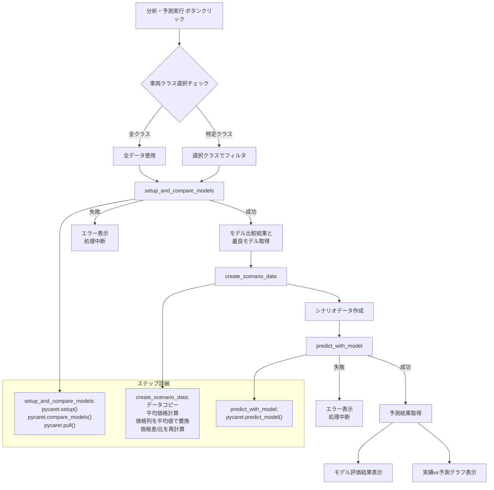

# 利用台数予測と分析の実行フロー

このドキュメントは、Streamlitアプリケーションで「分析・予測実行」ボタンがクリックされた後の、データ処理、モデル比較、予測、結果表示までの詳細なフローを説明します。

## 概要

ユーザーが分析対象のデータ（CSVファイル、車両クラス、利用日）を選択し、「分析・予測実行」ボタンを押すと、以下の主要な処理が実行されます。

1.  **モデル比較用データの準備:** 選択された車両クラスに基づいて、モデル比較に使用するデータを準備します。
2.  **モデル比較と最良モデルの選択:** PyCaretライブラリを使用し、ユーザーが選択した複数の機械学習モデルを訓練・評価し、指定された評価指標（RMSE）に基づいて最も性能の良いモデル（最良モデル）を選択します。
3.  **予測用シナリオデータの作成:** 選択された利用日の実績データに基づき、「もし価格が期間中の平均価格で一定だったら」という仮定のシナリオデータを作成します。
4.  **予測の実行:** 選択された最良モデルとシナリオデータを用いて、利用台数の予測値を計算します。
5.  **結果の表示:** モデル比較の結果（各モデルの評価指標）と、実績データと予測結果を比較するグラフを表示します。

## 処理フロー図 (Mermaid)

## 各ステップの詳細

1.  **モデル比較と最良モデル選択 (`setup_and_compare_models` in `utils/modeling.py`)**
    *   **入力:** 選択された車両クラスでフィルタリングされたデータ (`data_for_modeling`)、目的変数名 (`TARGET_VARIABLE`)、数値・カテゴリ特徴量のリスト (`selected_numeric`, `selected_categorical`)、比較対象モデルのリスト (`models_to_compare`)。
    *   **処理:**
        *   `pycaret.regression.setup()`: PyCaretの環境を初期化します。データ型推論、欠損値補完、カテゴリ特徴量のエンコーディングなどの前処理パイプラインを定義し、データを訓練用とテスト用に分割します。(`verbose=False`, `html=False` で実行され、Streamlit上での冗長な出力を抑制します。)
        *   `pycaret.regression.compare_models()`: `setup`で定義された前処理パイプラインを適用した後、指定されたモデル (`include_models`) を訓練し、クロスバリデーションによって評価します。指定された評価指標 (`sort_metric='RMSE'`) に基づいてモデルをランク付けし、最も性能の良いモデルを返します。(`verbose=False` で実行されます。)
        *   `pycaret.regression.pull()`: `compare_models` の実行結果（各モデルの評価指標がまとめられた表）をPandas DataFrameとして取得します。
    *   **出力:** 最良と判断されたモデルオブジェクト (`best_model`)、モデル比較結果のDataFrame (`comparison_results`)。処理に失敗した場合は `None` と空のDataFrameを返します。

2.  **予測用シナリオデータ作成 (`create_scenario_data` in `utils/data_processing.py`)**
    *   **入力:** ユーザーが選択した特定日のデータ (`data_filtered_sorted`)、価格関連の列名リスト (`PRICE_COLUMNS`)、シナリオタイプ (`scenario_type='mean'`)。
    *   **処理:**
        *   入力データのコピーを作成します。
        *   `scenario_type` が `'mean'` の場合、入力データ内の各価格列 (`PRICE_COLUMNS`) の平均値を計算します。
        *   コピーしたデータの価格列の値を、対応する計算済み平均値で全て上書きします。（これにより、価格が期間中一定だったというシナリオが作られます。）
        *   価格が変更されたため、価格差 (`