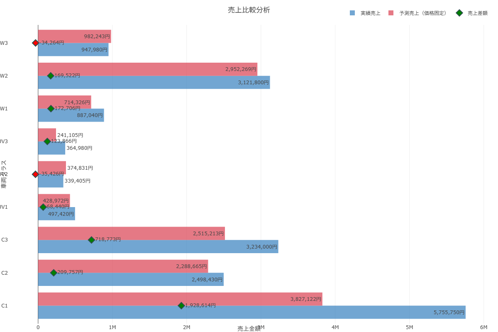
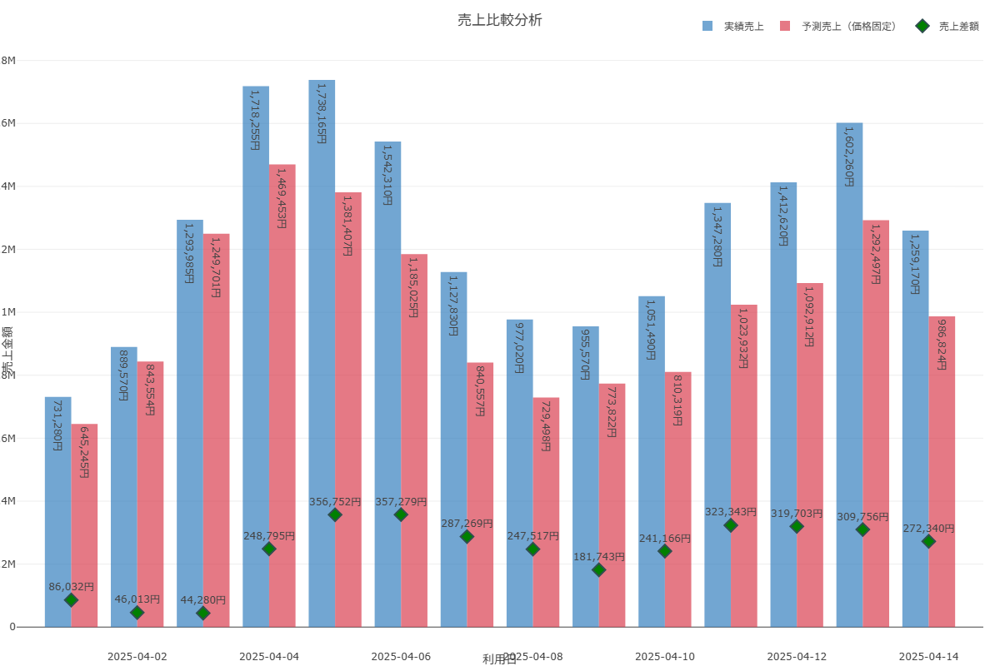

# バッチ予測結果サマリー

## 1. バッチ分析サマリー

```text
バッチ分析サマリー
実行日時: 20250507_145836
=================================
処理総数: 126件
成功: 117件, 失敗: 9件

売上集計結果:
実績総売上: 17,646,805円
予測総売上（価格固定）: 14,324,797円
売上差額（実績-予測）: 3,322,007円

全体分析: 期間全体で価格変更により 3,322,007円 の追加売上が発生したと推定されます。価格戦略は有効に機能しています。
```

## 2. クラス別売上サマリー



```csv
車両クラス,実績売上,予測売上,売上差額
C1,5755750,3827122,1928614
C2,2498430,2288665,209757
C3,3234000,2515213,718773
SUV1,497420,428972,68440
SUV2,339405,374831,-35426
SUV3,364980,241105,123866
W1,887040,714326,172706
W2,3121800,2952269,169522
W3,947980,982243,-34264
```

## 3. 日別売上サマリー



```csv
利用日,実績売上,予測売上,売上差額
2025-04-01,731280,645245,86032
2025-04-02,889570,843554,46013
2025-04-03,1293985,1249701,44280
2025-04-04,1718255,1469453,248795
2025-04-05,1738165,1381407,356752
2025-04-06,1542310,1185025,357279
2025-04-07,1127830,840557,287269
2025-04-08,977020,729498,247517
2025-04-09,955570,773822,181743
2025-04-10,1051490,810319,241166
2025-04-11,1347280,1023932,323343
2025-04-12,1412620,1092912,319703
2025-04-13,1602260,1292497,309756
2025-04-14,1259170,986824,272340
```

## 4. エラー詳細

```csv
日付,車両クラス,モデル,エラー内容
2025-04-01,SUV3,貸渡実績情報_1_SUV3,2025-04-01のSUV3データが存在しません
2025-04-02,SUV3,貸渡実績情報_1_SUV3,2025-04-02のSUV3データが存在しません
2025-04-07,SUV3,貸渡実績情報_1_SUV3,2025-04-07のSUV3データが存在しません
2025-04-08,SUV3,貸渡実績情報_1_SUV3,2025-04-08のSUV3データが存在しません
2025-04-08,W3,貸渡実績情報_1_W3,2025-04-08のW3データが存在しません
2025-04-09,W3,貸渡実績情報_1_W3,2025-04-09のW3データが存在しません
2025-04-10,W3,貸渡実績情報_1_W3,2025-04-10のW3データが存在しません
2025-04-14,SUV2,貸渡実績情報_1_SUV2,2025-04-14のSUV2データが存在しません
2025-04-14,SUV3,貸渡実績情報_1_SUV3,2025-04-14のSUV3データが存在しません
```

## 5. バッチ分析結果詳細 (抜粋)

以下は `batch_analysis_results.csv` の内容の抜粋です。全データは元ファイルを参照してください。

- **期間:** 2025-04-01 から 2025-04-14
- **分析対象:** 車両クラス毎の日別の実績売上と予測売上を比較し、価格変更リードタイムと売上差額を記録。
- **主な傾向:**
    - C1クラスは期間を通して安定して予測を上回る実績売上を達成。
    - SUV3、W3などの一部クラスでは、特定日にデータが存在せず予測が行えなかったケースが見られる。
    - 価格変更リードタイムは車両クラスや日付によって異なる。

(詳細な表データは `batch_analysis_results.csv` を参照) 