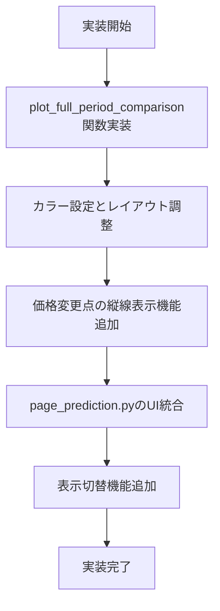
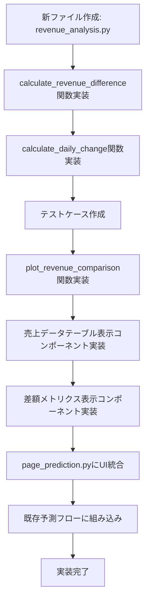
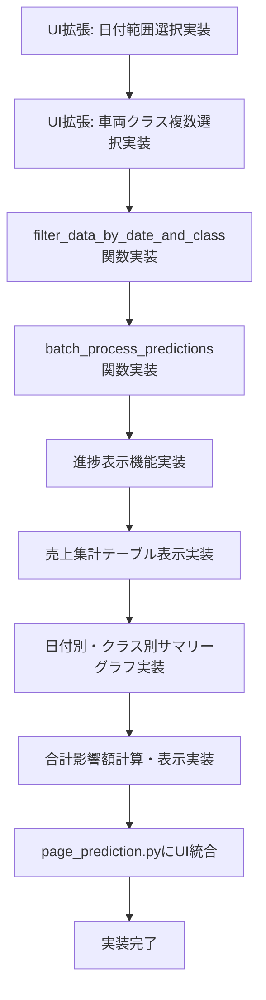

# 今後の開発ステップ (Next Steps)

最終更新: 2025-05-05 15:30 (JST)

このドキュメントは、利用台数予測と比較分析システムの今後の開発項目をまとめたものです。

## 1. 予約曲線の全期間比較表示

*   **[ ] 予測予約曲線の全期間プロット:**
    *   現在の実績vs予測グラフは価格最終変更リードタイム以降のみ表示している。
    *   これとは別に、**リードタイムの全期間**における「実績の予約曲線」と「価格固定シナリオでの予測予約曲線」を**1つのグラフ**に重ねて表示する機能を追加する。
    *   `plot_comparison_curve` を改修するか、新しいプロット関数を `utils/visualization.py` に作成する。

### 詳細実装計画

1. **関数設計**:
   * `utils/visualization.py` に `plot_full_period_comparison` 関数を新たに実装
   * 入力パラメータ:
     - `df_actual`: 実績データのDataFrame
     - `df_predicted`: 予測データのDataFrame
     - `x_col`: X軸に使用する列名（リードタイム）
     - `y_actual_col`: 実績データのY軸列名（利用台数累積）
     - `y_pred_col`: 予測データのY軸列名（prediction_label）
     - `title`: グラフタイトル（省略可）
     - `change_lead_time`: 価格変更点のリードタイム値（比較のためにマーカー表示用）
   * 戻り値: plotlyの`Figure`オブジェクト

2. **カラー設定**:
   * 実績: 青色 (`rgba(0, 123, 255, 0.8)`)
   * 予測: 赤色 (`rgba(220, 53, 69, 0.8)`)
   * 価格変更点: 緑色の縦線 (`rgba(40, 167, 69, 0.5)`, 破線)

3. **レイアウト改善**:
   * グラフ上部に凡例（実績、予測）を表示
   * ホバー時に表示する情報を充実（利用台数累積、リードタイム、[価格情報も表示可能か検討]）
   * 価格変更点にグラフ下側に説明テキスト追加

4. **UI統合**:
   * `utils/page_prediction.py` 内の「実績 vs 予測比較」セクションに新タブまたはエクスパンダーとして追加
   * 「全期間比較表示」と「価格変更後のみ表示」を切り替え可能にする

```python
# 実装例（一部）
def plot_full_period_comparison(df_actual, df_predicted, x_col, y_actual_col, y_pred_col, title=None, change_lead_time=None):
    """リードタイム全期間での実績vs予測比較グラフを生成"""
    fig = go.Figure()
    
    # 実績データプロット
    fig.add_trace(go.Scatter(
        x=df_actual[x_col],
        y=df_actual[y_actual_col],
        mode='lines+markers',
        name='実績値',
        line=dict(color='rgba(0, 123, 255, 0.8)', width=2),
        marker=dict(size=6)
    ))
    
    # 予測データプロット
    fig.add_trace(go.Scatter(
        x=df_predicted[x_col],
        y=df_predicted[y_pred_col],
        mode='lines+markers',
        name='予測値（価格固定シナリオ）',
        line=dict(color='rgba(220, 53, 69, 0.8)', width=2),
        marker=dict(size=6)
    ))
    
    # 価格変更点の表示
    if change_lead_time is not None:
        fig.add_vline(
            x=change_lead_time, 
            line_dash="dash", 
            line_color="rgba(40, 167, 69, 0.5)",
            annotation_text=f"価格最終変更点 (LT={change_lead_time})",
            annotation_position="bottom right"
        )
    
    # グラフレイアウト設定
    fig.update_layout(
        title=title or "全期間での実績 vs 予測比較",
        xaxis_title=f"リードタイム ({x_col})",
        yaxis_title=f"利用台数累積",
        legend=dict(orientation="h", yanchor="bottom", y=1.02, xanchor="right", x=1),
        margin=dict(l=20, r=20, t=60, b=20),
        hovermode="x unified"
    )
    
    return fig
```



## 2. 売上金額ベースでの比較分析

*   **[ ] シナリオ別総売上計算ロジック:**
    *   **計算単位:** 各リードタイム日の**新規予約数** (`利用台数累積` または `予測利用台数累積` の差分) × その日の**適用価格**。
    *   **計算対象期間:** 価格最終変更リードタイム（`change_lead_time`）**以降**の期間のみ。
    *   **実績売上:** 価格変更後の期間における実際の新規予約数 × 各リードタイム時点での実際の `価格_トヨタ` の合計。
    *   **予測売上（価格固定シナリオ）:** 価格変更後の期間における予測された新規予約数 × `change_lead_time` 時点の固定 `価格_トヨタ` の合計。
    *   上記計算を行う関数を `utils/analysis.py` に実装する。差分計算の初日扱いに注意。
*   **[ ] 売上差額の可視化:**
    *   上記で計算した「実績売上」と「予測売上（価格固定シナリオ）」の**差額**（実績 - 予測）をテーブルまたはメトリクスで表示する。
    *   （オプション）リードタイムごとの累積売上推移グラフを追加。
    *   （オプション）現在の実績vs予測テーブルに日次/累積売上を追加。

### 詳細実装計画

1. **新機能モジュール作成**:
   * `utils/revenue_analysis.py` という新しいファイルを作成し、売上計算に関する関数を集約

2. **売上計算関数の実装**:
   ```python
   def calculate_revenue_difference(
       df_actual,          # 実績データ
       df_predicted,       # 予測データ
       lead_time_col,      # リードタイム列名
       actual_usage_col,   # 実績利用台数累積列名 
       pred_usage_col,     # 予測利用台数累積列名
       price_col,          # 価格列名（価格_トヨタを想定）
       change_lead_time    # 価格変更点リードタイム
   ):
       """実績と予測シナリオの売上差額を計算する関数"""
       # 結果格納用のDataFrame
       result_df = pd.DataFrame()
       
       # リードタイムで並べ替え
       df_actual_sorted = df_actual.sort_values(by=lead_time_col)
       df_pred_sorted = df_predicted.sort_values(by=lead_time_col)
       
       # 価格変更点以降のデータに絞る
       df_actual_filtered = df_actual_sorted[df_actual_sorted[lead_time_col] <= change_lead_time]
       df_pred_filtered = df_pred_sorted[df_pred_sorted[lead_time_col] <= change_lead_time]
       
       # 各リードタイムにおける新規予約数の計算（差分）
       result_df[lead_time_col] = df_actual_filtered[lead_time_col]
       
       # 日次変化量の計算（当日 - 前日）、初日は累積値そのもの
       result_df['actual_new_bookings'] = calculate_daily_change(df_actual_filtered, actual_usage_col)
       result_df['pred_new_bookings'] = calculate_daily_change(df_pred_filtered, pred_usage_col)
       
       # 価格の取得
       result_df['actual_price'] = df_actual_filtered[price_col]
       result_df['fixed_price'] = df_actual_filtered.loc[df_actual_filtered[lead_time_col] == change_lead_time, price_col].iloc[0]
       
       # 売上の計算
       result_df['actual_revenue'] = result_df['actual_new_bookings'] * result_df['actual_price']
       result_df['predicted_revenue'] = result_df['pred_new_bookings'] * result_df['fixed_price']
       
       # 累計売上の計算
       result_df['actual_revenue_cumsum'] = result_df['actual_revenue'].cumsum()
       result_df['predicted_revenue_cumsum'] = result_df['predicted_revenue'].cumsum()
       
       # 差額の計算（実績 - 予測）
       result_df['revenue_difference'] = result_df['actual_revenue'] - result_df['predicted_revenue']
       result_df['revenue_difference_cumsum'] = result_df['actual_revenue_cumsum'] - result_df['predicted_revenue_cumsum']
       
       # 合計値の計算
       total_actual = result_df['actual_revenue'].sum()
       total_predicted = result_df['predicted_revenue'].sum()
       total_difference = total_actual - total_predicted
       
       return result_df, total_actual, total_predicted, total_difference
   
   def calculate_daily_change(df, cumulative_col):
       """日次変化量（新規予約数）を計算する補助関数"""
       daily_change = df[cumulative_col].copy()
       daily_change.iloc[1:] = daily_change.iloc[1:].values - daily_change.iloc[:-1].values
       return daily_change
   ```

3. **売上グラフ表示関数の実装**:
   * `utils/visualization.py` に `plot_revenue_comparison` 関数を実装
   * 売上推移とともに累計売上も表示
   * 実績と予測の差額をハイライト表示

4. **UI統合**:
   * `utils/page_prediction.py` の予測実行セクションに「売上分析」タブまたはエクスパンダーを追加
   * 売上データテーブルと売上差額メトリクスを表示するコンポーネントを実装
   * 予測実行時に自動で売上計算も実行されるようにフロー修正

5. **メトリクス表示**:
   * 実績合計売上、予測合計売上、差額を目立つメトリクスとして表示
   * 差額が正の場合は青、負の場合は赤で表示し、変更による効果を視覚的に示す



## 3. 複数日付範囲での集計分析

*   **[ ] 日付範囲・車両クラス複数選択UI:**
    *   サイドバーで単一日付だけでなく、開始日と終了日の範囲を選択できるようにする。
    *   **車両クラスも複数選択できるようにする（例: チェックボックスやマルチセレクト）。**
*   **[ ] 複数日・複数クラス バッチ処理:**
    *   選択された日付範囲内の各利用日**と、選択された各車両クラス**の組み合わせに対して、以下の処理を自動で実行するループを実装する。
        1.  該当クラス・日付でデータをフィルタリング。
        2.  価格最終変更点の検出。
        3.  価格固定シナリオのデータ作成。
        4.  選択されたモデルによる予測。
        5.  売上差額の計算。
*   **[ ] 集計結果表示:**
    *   日付範囲・**選択クラス全体**での合計売上差額（価格変更による影響額の合計）を算出して表示する。
    *   オプションとして、日付ごと、**クラスごと**の結果一覧テーブル、または集計結果を表示する。

### 詳細実装計画

1. **UI拡張**:
   * `utils/ui_components.py` の `render_prediction_sidebar_widgets` 関数を修正
   * 日付選択を単一選択から範囲選択に拡張:
   ```python
   # 利用日の範囲選択
   st.subheader("利用日範囲の選択")
   available_dates = data[DATE_COLUMN].dt.date.unique()
   min_date = min(available_dates) if len(available_dates) > 0 else None
   max_date = max(available_dates) if len(available_dates) > 0 else None
   
   col1, col2 = st.columns(2)
   with col1:
       start_date = st.date_input("開始日", value=min_date, min_value=min_date, max_value=max_date)
   with col2:
       end_date = st.date_input("終了日", value=min_date, min_value=min_date, max_value=max_date)
   
   if end_date < start_date:
       st.error("終了日は開始日以降に設定してください。")
       end_date = start_date
   ```
   
   * 車両クラス複数選択に変更:
   ```python
   # 車両クラス複数選択
   if CAR_CLASS_COLUMN in data.columns:
       available_classes = data[CAR_CLASS_COLUMN].unique()
       selected_classes = st.multiselect(
           f"'{CAR_CLASS_COLUMN}'を選択（複数可）:",
           options=sorted(list(available_classes)),
           default=[available_classes[0]] if len(available_classes) > 0 else [],
           key="pred_class_multiselect"
       )
       # 「全クラス」オプションを別途チェックボックスで提供
       all_classes = st.checkbox("全クラスを含める", value=True)
       if all_classes:
           selected_classes = list(available_classes)
   ```

2. **バッチ処理ロジック実装**:
   * `utils/page_prediction.py` に複数日・クラスの組み合わせに対するバッチ処理関数を実装:
   ```python
   def batch_process_predictions(
       data, 
       model_info, 
       start_date, 
       end_date, 
       selected_classes, 
       model
   ):
       """複数日・複数クラスに対するバッチ予測処理"""
       # 結果格納用
       batch_results = []
       
       # 日付データを作成（開始日〜終了日）
       date_range = pd.date_range(start=start_date, end=end_date)
       
       # 進捗表示
       progress_bar = st.progress(0)
       total_combinations = len(date_range) * len(selected_classes)
       current_index = 0
       
       # 各日付・クラスの組み合わせに対して処理
       for target_date in date_range:
           for car_class in selected_classes:
               # 進捗更新
               current_index += 1
               progress_bar.progress(current_index / total_combinations)
               
               # ステータスメッセージ
               st.text(f"処理中: {target_date.date()} ({car_class})")
               
               # フィルタリング
               filtered_data = filter_data_by_date_and_class(data, DATE_COLUMN, target_date, CAR_CLASS_COLUMN, car_class)
               
               # 価格変更点検出
               if filtered_data.empty or LEAD_TIME_COLUMN not in filtered_data.columns:
                   continue
                   
               filtered_data_sorted = filtered_data.sort_values(by=LEAD_TIME_COLUMN)
               last_change_lt = find_last_price_change_lead_time(filtered_data_sorted, PRICE_COLUMNS, LEAD_TIME_COLUMN)
               
               if last_change_lt is None:
                   continue
                   
               # シナリオデータ作成
               data_scenario = create_scenario_data(
                   filtered_data_sorted, 
                   PRICE_COLUMNS, 
                   LEAD_TIME_COLUMN,
                   scenario_type='last_change_fixed', 
                   change_lead_time=last_change_lt
               )
               
               if data_scenario.empty:
                   continue
                   
               # 予測実行
               try:
                   # ターゲット変数がある場合は除去
                   if TARGET_VARIABLE in data_scenario.columns:
                       X = data_scenario.drop(columns=[TARGET_VARIABLE])
                   else:
                       X = data_scenario
                       
                   # モデル予測
                   model_metadata = get_model_metadata(model_info.get("filename"))
                   if model_metadata and "model_columns" in model_metadata:
                       transformed_data = prepare_features_for_prediction(X, model_metadata)
                       y_pred = model.predict(transformed_data)
                   else:
                       # 特徴量変換なしで直接予測
                       y_pred = model.predict(X)
                       
                   # 結果をDataFrameに追加
                   predictions_result = data_scenario.copy()
                   predictions_result['prediction_label'] = y_pred
                   
                   # 売上計算
                   revenue_df, total_actual, total_predicted, total_difference = calculate_revenue_difference(
                       filtered_data_sorted,
                       predictions_result,
                       LEAD_TIME_COLUMN,
                       TARGET_VARIABLE,
                       'prediction_label',
                       '価格_トヨタ',
                       last_change_lt
                   )
                   
                   # 結果格納
                   batch_results.append({
                       'date': target_date.date(),
                       'car_class': car_class,
                       'last_change_lt': last_change_lt,
                       'actual_revenue': total_actual,
                       'predicted_revenue': total_predicted,
                       'revenue_difference': total_difference,
                       'data_points': len(revenue_df)
                   })
                   
               except Exception as e:
                   st.warning(f"予測エラー {target_date.date()} ({car_class}): {e}")
       
       # 結果をDataFrameに変換
       results_df = pd.DataFrame(batch_results)
       
       return results_df
   ```

3. **集計・表示機能**:
   * 日付別・クラス別の詳細テーブル表示
   * 集計データのグラフ化（日付ごと、クラスごとの影響額棒グラフ）
   * 総合評価メトリクス表示（合計影響額、平均影響額など）

4. **進捗表示と途中結果**:
   * 長時間処理に対応するため、進捗バー表示
   * 各組み合わせの処理完了ごとに途中結果を表示する機能



## 4. モデルの保存と再利用 [✓ 完了]

~~*   **[ ] モデル保存機能:**~~
~~    *   `setup_and_compare_models` で選択された最良モデル (`best_model`) を、選択された車両クラスと利用日などの情報とともにファイル（例: pickle形式）に保存する機能を追加する。~~
~~    *   UIに保存ボタンを設け、ユーザーが任意のタイミングでモデルを保存できるようにする。~~
~~*   **[ ] モデル読み込み・予測機能:**~~
~~    *   サイドバー等で「予測モード」のような選択肢を追加する。~~
~~    *   予測モードでは、過去に保存したモデルファイルを選択し、それを読み込む。~~
~~    *   読み込んだモデルを使って、新たに選択された（またはCSVに含まれる）日付のデータに対して予測を実行できるようにする。~~
~~    *   `predict_with_model` 関数が保存済みモデルを扱えるように拡張する。~~

### 既に実装済みの機能

この機能は既に実装され、以下の機能が利用可能です：

1. **モデル保存機能**:
   * `utils/model_storage.py` にモデルの保存・読み込み・管理機能が実装されている
   * `utils/page_model_training.py` で学習後にモデルが自動保存される
   * 保存されるファイルには、モデル本体(`.pkl`)、メタデータ(`.json`)、比較結果(`.csv`)が含まれる

2. **モデル読み込み・予測機能**:
   * `utils/page_prediction.py` でモデル選択と読み込みが可能
   * サイドバーに折りたたみ式の「保存済みモデル一覧」が表示され、全モデルの情報を確認可能
   * 予測実行時にモデルによる予測処理が行われる
   * 特徴量データの変換や欠損値処理も含めた予測が可能

3. **モデル管理機能**:
   * モデルの性能指標や基本情報の表示
   * 車両クラスに紐づいたモデル適用の制御

これらの機能は基本的に完成しており、必要に応じて以下の拡張を検討することができます：

* より詳細なモデルの説明・解釈機能
* モデル性能の比較ダッシュボード
* モデル再トレーニング機能

## その他

*   **[ ] エラーハンドリング強化:** 
    * 各ステップでの予期せぬエラー（データ不足、モデル学習失敗など）に対するハンドリングをより丁寧にする。
    * 特に予測時の「feature_names mismatch」エラーの追加対策を実装する。
    * 日付型やオブジェクト型のカラムがXGBoostで処理できない問題の解決方法を改善する。

*   **[ ] パフォーマンス改善:** 
    * データ量が多い場合に処理が遅くなる可能性があれば、キャッシュ戦略の見直しや計算の効率化を検討する。
    * 特に複数日付範囲での集計分析機能実装時には、並列処理の導入も検討する。
    * `@st.cache_data`や`@st.cache_resource`を適切に活用し、同じ計算の繰り返しを防ぐ。

*   **[ ] コードリファクタリング:** 
    * 機能追加に伴い、コードの可読性や保守性を維持するためのリファクタリングを適宜行う。
    * 特に`page_prediction.py`に多くの処理が集中するため、分割を検討する。
    * 良く使われる関数を共通ユーティリティとして整理する。

*   **[ ] 行数制限とモジュール化:** 
    * 各Pythonファイルが400行を超えないように注意する。超える場合は、機能ごとにファイルを分割するなどしてモジュール化を検討する。
    * 現在の`page_prediction.py`は複雑化しているため、以下のように分割することを検討：
      - `page_prediction.py` - メインのUIと予測フロー管理
      - `prediction_processing.py` - 予測処理の実装
      - `prediction_visualization.py` - 予測結果の可視化

*   **[ ] 機能テスト:** 
    * 各機能の単体テストを実装して、特に計算ロジックの正確性を確認する。
    * データサンプルを用いた統合テストを実装し、エンドツーエンドの動作確認を行う。

*   **[ ] ドキュメント更新:** 
    * 新機能の追加に合わせて`README.md`を更新する。
    * 実装後のユーザーガイドやチュートリアルを作成する。 