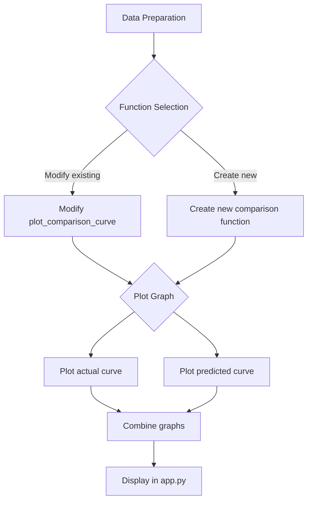
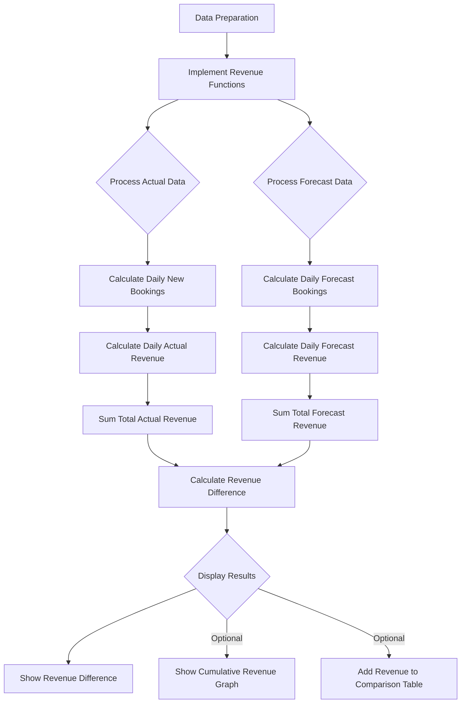
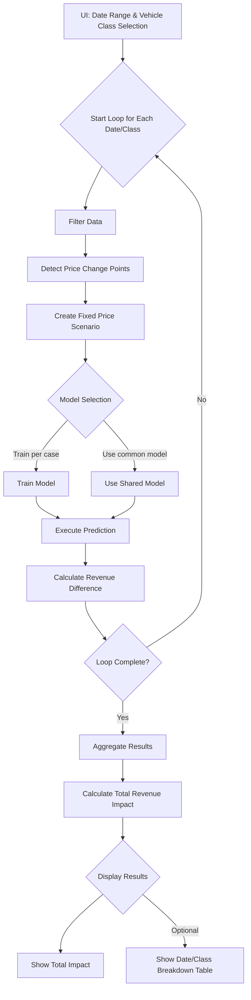
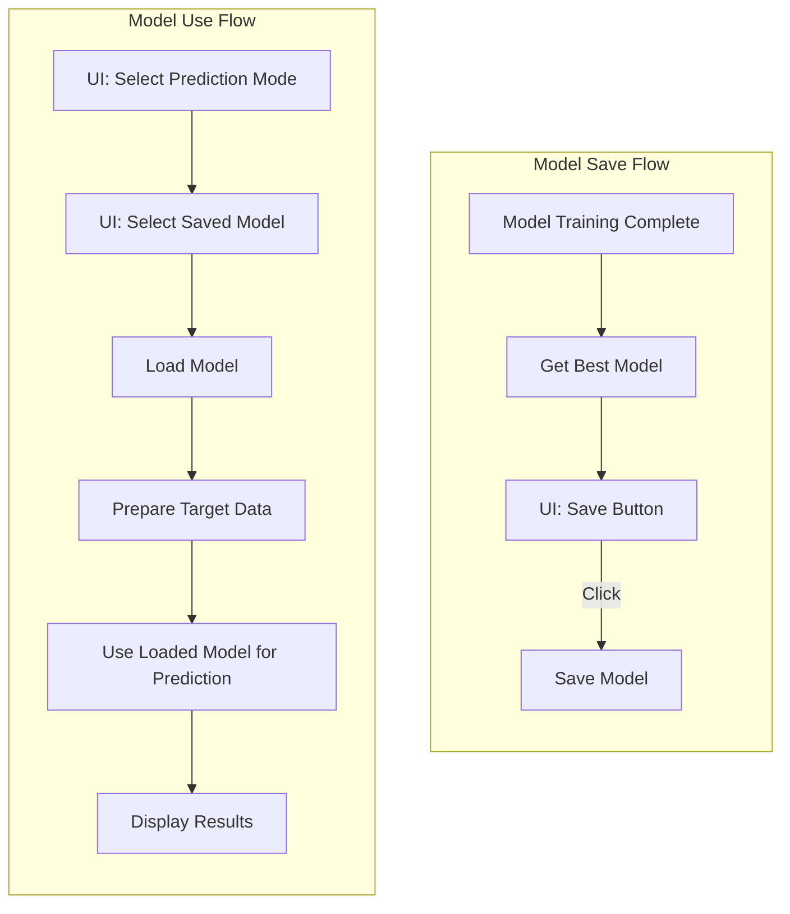

# 今後の開発ステップ (Next Steps)

最終更新: 2025-05-04 09:42 (JST)

このドキュメントは、利用台数予測と比較分析システムの今後の開発項目をまとめたものです。

## 1. 予約曲線の全期間比較表示

*   **[ ] 予測予約曲線の全期間プロット:**
    *   現在の実績vs予測グラフは価格最終変更リードタイム以降のみ表示している。
    *   これとは別に、**リードタイムの全期間**における「実績の予約曲線」と「価格固定シナリオでの予測予約曲線」を**1つのグラフ**に重ねて表示する機能を追加する。
    *   `plot_comparison_curve` を改修するか、新しいプロット関数を `utils/visualization.py` に作成する。

## 2. 売上金額ベースでの比較分析

*   **[ ] シナリオ別総売上計算ロジック:**
    *   **計算単位:** 各リードタイム日の**新規予約数** (`利用台数累積` または `予測利用台数累積` の差分) × その日の**適用価格**。
    *   **実績総売上:** 実際の新規予約数 × 各リードタイム時点での実際の `価格_トヨタ` を**全リードタイムで合計**。
    *   **予測総売上（価格固定シナリオ）:** 予測された新規予約数 × `change_lead_time` 時点の `価格_トヨタ` (この固定価格を全リードタイムで使用) を**全リードタイムで合計**。
    *   上記計算を行う関数を `app.py` または `utils` に実装する。差分計算の初日扱いに注意。
*   **[ ] 売上差額の可視化:**
    *   上記で計算した「実績総売上」と「予測総売上（価格固定シナリオ）」の**最終的な差額**（実績 - 予測）をテーブルまたはメトリクスで表示する。
    *   （オプション）リードタイムごとの累積売上推移グラフを追加。
    *   （オプション）現在の実績vs予測テーブルに日次/累積売上を追加。

## 3. 複数日付範囲での集計分析

*   **[ ] 日付範囲・車両クラス複数選択UI:**
    *   サイドバーで単一日付だけでなく、開始日と終了日の範囲を選択できるようにする。
    *   **車両クラスも複数選択できるようにする（例: チェックボックスやマルチセレクト）。**
*   **[ ] 複数日・複数クラス バッチ処理:**
    *   選択された日付範囲内の各利用日**と、選択された各車両クラス**の組み合わせに対して、以下の処理を自動で実行するループを実装する。
        1.  該当クラス・日付でデータをフィルタリング。
        2.  価格最終変更点の検出。
        3.  価格固定シナリオのデータ作成。
        4.  最良モデル（範囲やクラスで共通のモデルを使うか、都度学習するか検討）による予測。
        5.  売上差額の計算。
*   **[ ] 集計結果表示:**
    *   日付範囲・**選択クラス全体**での合計売上差額（価格変更による影響額の合計）を算出して表示する。
    *   オプションとして、日付ごと、**クラスごと**の結果一覧テーブル、または集計結果を表示する。

## 4. モデルの保存と再利用

*   **[ ] モデル保存機能:**
    *   `setup_and_compare_models` で選択された最良モデル (`best_model`) を、選択された車両クラスと利用日などの情報とともにファイル（例: pickle形式）に保存する機能を追加する。
    *   UIに保存ボタンを設け、ユーザーが任意のタイミングでモデルを保存できるようにする。
*   **[ ] モデル読み込み・予測機能:**
    *   サイドバー等で「予測モード」のような選択肢を追加する。
    *   予測モードでは、過去に保存したモデルファイルを選択し、それを読み込む。
    *   読み込んだモデルを使って、新たに選択された（またはCSVに含まれる）日付のデータに対して予測を実行できるようにする。
    *   `predict_with_model` 関数が保存済みモデルを扱えるように拡張する。

## その他

*   **[ ] エラーハンドリング強化:** 各ステップでの予期せぬエラー（データ不足、モデル学習失敗など）に対するハンドリングをより丁寧にする。
*   **[ ] パフォーマンス改善:** データ量が多い場合に処理が遅くなる可能性があれば、キャッシュ戦略の見直しや計算の効率化を検討する。
*   **[ ] コードリファクタリング:** 機能追加に伴い、コードの可読性や保守性を維持するためのリファクタリングを適宜行う。
*   **[ ] 行数制限とモジュール化:** 各Pythonファイルが400行を超えないように注意する。超える場合は、機能ごとにファイルを分割するなどしてモジュール化を検討する。 